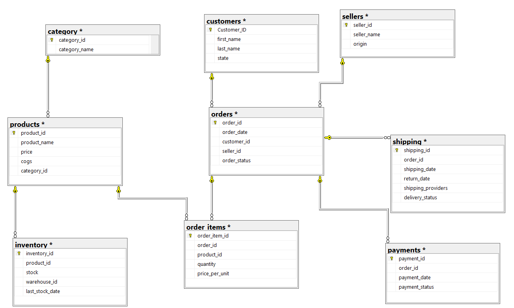
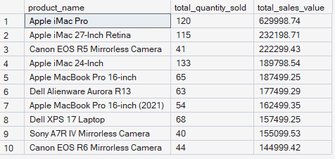

# **Amazon USA Sales Analysis Project**

### **Difficulty Level: Advanced**

---

## **Project Overview**

I have worked on analyzing a dataset of over 20,000 sales records from an Amazon-like e-commerce platform. This project involves extensive querying of customer behavior, product performance, and sales trends using PostgreSQL. Through this project, I have tackled various SQL problems, including revenue analysis, customer segmentation, and inventory management.

The project also focuses on data cleaning, handling null values, and solving real-world business problems using structured queries.

An ERD diagram is included to visually represent the database schema and relationships between tables.

---



## **Database Setup & Design**

### **Schema Structure**

```sql
CREATE TABLE category
(
  category_id	INT PRIMARY KEY,
  category_name VARCHAR(20)
);

-- customers TABLE
CREATE TABLE customers
(
  customer_id INT PRIMARY KEY,	
  first_name	VARCHAR(20),
  last_name	VARCHAR(20),
  state VARCHAR(20),
  address VARCHAR(5) DEFAULT ('xxxx')
);

-- sellers TABLE
CREATE TABLE sellers
(
  seller_id INT PRIMARY KEY,
  seller_name	VARCHAR(25),
  origin VARCHAR(15)
);

-- products table
  CREATE TABLE products
  (
  product_id INT PRIMARY KEY,	
  product_name VARCHAR(50),	
  price	FLOAT,
  cogs	FLOAT,
  category_id INT, -- FK 
  CONSTRAINT product_fk_category FOREIGN KEY(category_id) REFERENCES category(category_id)
);

-- orders
CREATE TABLE orders
(
  order_id INT PRIMARY KEY, 	
  order_date	DATE,
  customer_id	INT, -- FK
  seller_id INT, -- FK 
  order_status VARCHAR(15),
  CONSTRAINT orders_fk_customers FOREIGN KEY (customer_id) REFERENCES customers(customer_id),
  CONSTRAINT orders_fk_sellers FOREIGN KEY (seller_id) REFERENCES sellers(seller_id)
);

CREATE TABLE order_items
(
  order_item_id INT PRIMARY KEY,
  order_id INT,	-- FK 
  product_id INT, -- FK
  quantity INT,	
  price_per_unit FLOAT,
  CONSTRAINT order_items_fk_orders FOREIGN KEY (order_id) REFERENCES orders(order_id),
  CONSTRAINT order_items_fk_products FOREIGN KEY (product_id) REFERENCES products(product_id)
);

-- payment TABLE
CREATE TABLE payments
(
  payment_id	
  INT PRIMARY KEY,
  order_id INT, -- FK 	
  payment_date DATE,
  payment_status VARCHAR(20),
  CONSTRAINT payments_fk_orders FOREIGN KEY (order_id) REFERENCES orders(order_id)
);

CREATE TABLE shippings
(
  shipping_id	INT PRIMARY KEY,
  order_id	INT, -- FK
  shipping_date DATE,	
  return_date	 DATE,
  shipping_providers	VARCHAR(15),
  delivery_status VARCHAR(15),
  CONSTRAINT shippings_fk_orders FOREIGN KEY (order_id) REFERENCES orders(order_id)
);

CREATE TABLE inventory
(
  inventory_id INT PRIMARY KEY,
  product_id INT, -- FK
  stock INT,
  warehouse_id INT,
  last_stock_date DATE,
  CONSTRAINT inventory_fk_products FOREIGN KEY (product_id) REFERENCES products(product_id)
  );
```

---

## **Task: Data Cleaning**

I cleaned the dataset by:
- **Removing duplicates**: Duplicates in the customer and order tables were identified and removed.
- **Handling missing values**: Null values in critical fields (e.g., customer address, payment status) were either filled with default values or handled using appropriate methods.

---

## **Handling Null Values**

Null values were handled based on their context:
- **Customer addresses**: Missing addresses were assigned default placeholder values.
- **Payment statuses**: Orders with null payment statuses were categorized as “Pending.”
- **Shipping information**: Null return dates were left as is, as not all shipments are returned.

---

## **Objective**

The primary objective of this project is to showcase SQL proficiency through complex queries that address real-world e-commerce business challenges. The analysis covers various aspects of e-commerce operations, including:
- Customer behavior
- Sales trends
- Inventory management
- Payment and shipping analysis
- Forecasting and product performance
  

## **Identifying Business Problems**

Key business problems identified:
1. Low product availability due to inconsistent restocking.
2. High return rates for specific product categories.
3. Significant delays in shipments and inconsistencies in delivery times.
4. High customer acquisition costs with a low customer retention rate.

---

## **Solving Business Problems**

### Solutions Implemented:
1. Top Selling Products
Query the top 10 products by total sales value.
Challenge: Include product name, total quantity sold, and total sales value.

```sql
SELECT TOP 10
	p.product_name,
	COUNT(o.order_id) AS total_quantity_sold,
	SUM(oi.price_per_unit* oi.quantity) AS total_sales_value
FROM orders o
JOIN order_items oi
	ON oi.order_id = o.order_id
JOIN products p
	ON p.product_id = oi.product_id
GROUP BY 
	p.product_name
ORDER BY 
	total_sales_value DESC
```


2. Revenue by Category
Calculate total revenue generated by each product category.
Challenge: Include the percentage contribution of each category to total revenue.

```sql
SELECT
	c.category_id,
	c.category_name,
	SUM(oi.price_per_unit* oi.quantity) AS total_rev,
	SUM(oi.price_per_unit* oi.quantity)/ (SELECT SUM(price_per_unit* quantity) FROM order_items) *100 AS total_rev_pct
FROM orders AS o
JOIN order_items AS oi
	ON o.order_id = oi.order_id
JOIN products AS p
	ON p.product_id = oi.product_id
JOIN category AS c
	ON c.category_id = p.category_id
GROUP BY 
	c.category_id,
	c.category_name
ORDER BY
	total_rev DESC
```


3. Average Order Value (AOV)
Compute the average order value for each customer.
Challenge: Include only customers with more than 5 orders.

```sql
SELECT
	c.customer_id,
	c.first_name,
	COUNT(DISTINCT o.order_id) AS total_orders,
	SUM(oi.price_per_unit * oi.quantity) AS total_rev,
	SUM(oi.price_per_unit * oi.quantity)/COUNT(o.order_id) AS AOV
FROM orders AS o
JOIN order_items AS oi
	ON oi.order_id = o.order_id
JOIN customers AS c
	ON c.Customer_ID = o.customer_id
GROUP BY 
	c.customer_id,
	c.first_name
HAVING COUNT(o.order_id) > 5
ORDER BY 
	AOV DESC;
```

4. Monthly Sales Trend
Query monthly total sales over the past year.
Challenge: Display the sales trend, grouping by month, return current_month sale, last month sale!

```sql
 WITH monthly_sales AS (
 SELECT
	YEAR(o.order_date) AS year_,
	MONTH(o.order_date) AS month_,
	SUM(oi.price_per_unit * oi.quantity) AS total_sales,
	LAG(SUM(oi.price_per_unit * oi.quantity)) OVER(ORDER BY YEAR(o.order_date), MONTH(O.order_date)) AS previous_month_sales
FROM orders AS o
JOIN order_items AS oi
	ON oi.order_id = o.order_id
GROUP BY 
	YEAR(o.order_date) ,
	MONTH(o.order_date)
	)

SELECT
	year_,
	month_,
	total_sales,
	previous_month_sales,
	ROUND(
		((total_sales- previous_month_sales)*100.0/ previous_month_sales),2)  AS MOM
FROM monthly_sales

```


6. Best-Selling Categories by State
Identify the least-selling product category for each state.
Challenge: Include the total sales for that category within each state.

```sql
WITH topcategories AS (
SELECT 
	c.state AS state,
	ca.category_name AS category ,
	COUNT( DISTINCT o.order_id) AS total_orders,
	ROW_NUMBER()  OVER(PARTITION BY c.state ORDER BY COUNT( DISTINCT o.order_id) DESC ) AS category_rank
FROM orders AS o
JOIN order_items AS oi
	ON oi.order_id = o.order_id
JOIN customers AS c
	ON c.Customer_ID = o.customer_id
JOIN products AS p
	ON p.product_id = oi.product_id
JOIN category AS ca
	ON ca.category_id = p.category_id
GROUP BY 
	c.state,
	ca.category_name
)

SELECT 
	state,
	category,
	total_orders,
	category_rank
FROM topcategories
WHERE category_rank<=3
```


8. Inventory Stock Alerts
Query products with stock levels below a certain threshold (e.g., less than 10 units).
Challenge: Include last restock date and warehouse information.

```sql
SELECT 
	p.product_id,
	p.product_name,
	i.last_stock_date,
	i.warehouse_id,
	i.stock
FROM order_items AS oi
JOIN products AS p
	ON p.product_id = oi.product_id
JOIN inventory AS i
	ON i.product_id = p.product_id
WHERE i.stock < 10

```

9. Shipping Delays
Identify orders where the shipping date is later than 3 days after the order date.
Challenge: Include customer, order details, and delivery provider.

```sql
SELECT
	COUNT(o.order_id) AS delayed_orders
FROM orders AS o
JOIN shipping AS s
	ON o.order_id = s.order_id
WHERE DATEDIFF(DAY, o.order_date, s.shipping_date)> 3
```

10. Payment Success Rate 
Calculate the percentage of successful payments across all orders.
Challenge: Include breakdowns by payment status (e.g., failed, pending).

```sql
SELECT
	p.payment_status,
	COUNT(o.order_id) AS number_of_orders,
	ROUND(COUNT(o.order_id)*100.0/ (SELECT COUNT(order_id) FROM orders),2) AS orders_pct
FROM orders AS o
JOIN payments AS p
	ON o.order_id = p.order_id
GROUP BY p.payment_status
```

11. Top Performing Sellers
Find the top 5 sellers based on total sales value.
Challenge: Include both successful and failed orders, and display their percentage of successful orders.

```sql
SELECT TOP 10
	s.seller_id,
	s.seller_name,
	SUM(oi.price_per_unit * oi.quantity) as sales
FROM orders AS o
JOIN order_items AS oi
	ON o.order_id = oi.order_id
JOIN sellers AS s
	ON s.seller_id = o.seller_id
JOIN payments AS p
	ON p.order_id = o.order_id
WHERE p.payment_status = 'Payment Successed'
GROUP BY 
	s.seller_id,
	s.seller_name
ORDER BY sales DESC

```


12. Product Profit Margin
Calculate the profit margin for each product (difference between price and cost of goods sold).
Challenge: Rank products by their profit margin, showing highest to lowest.
*/


```sql
SELECT
	product_id,
	product_name,
	(price-cogs) AS profit_margin,
	DENSE_RANK() OVER(ORDER BY (price-cogs) DESC) AS profit_margin_position
FROM products
```

13. Most Returned Products
Query the top 10 products by the number of returns.
Challenge: Display the return rate as a percentage of total units sold for each product.

```sql
SELECT TOP 10
	p.product_id,
	p.product_name,
	COUNT( DISTINCT s.order_id) AS number_of_times_returned
FROM order_items AS oi
JOIN products AS p
	ON p.product_id = oi.product_id
JOIN shipping AS s
	ON s.order_id = oi.order_id
WHERE s.delivery_status = 'Returned'
GROUP BY 
	p.product_id,
	p.product_name
ORDER BY number_of_times_returned DESC
```

14. Inactive Sellers
Identify sellers who haven’t made any sales in the last 6 months.
Challenge: Show the last sale date and total sales from those sellers.

```sql
SELECT 
    s.seller_id,
    s.seller_name,
    MAX(o.order_date) AS last_order_date
FROM sellers AS s
LEFT JOIN orders AS o
    ON o.seller_id = s.seller_id
GROUP BY
	s.seller_id,
	s.seller_name
HAVING MAX(o.order_date) < DATEADD(MONTH, -6, (SELECT MAX(order_date) FROM orders))
    OR MAX(o.order_date) IS NULL
```


15. IDENTITY customers into returning or new
if the customer has done more than 5 return categorize them as returning otherwise new
Challenge: List customers id, name, total orders, total returns

```sql
WITH returncte AS (
SELECT
	CONCAT(c.first_name,' ',c.last_name) AS full_name,
	COUNT( DISTINCT o.order_id) AS total_orders,
	SUM(CASE WHEN o.order_status = 'Returned' THEN 1 ELSE 0 END ) AS total_return
FROM orders AS o
JOIN shipping AS s
	ON s.order_id = o.order_id
JOIN customers AS c
	ON c.Customer_ID = o.customer_id
GROUP BY 
	CONCAT(c.first_name,' ',c.last_name)
)


SELECT 
	full_name,
	total_orders,
	total_return,
	CASE 
		WHEN total_return >= 5 THEN 'returning' ELSE 'new' END AS Customer_category
FROM returncte;

```


16. Top 5 Customers by Orders in Each State
Identify the top 5 customers with the highest number of orders for each state.
Challenge: Include the number of orders and total sales for each customer.
```sql
WITH customerrankcte AS (
SELECT 
	 c.state AS state,
	CONCAT(c.first_name, ' ', c.last_name) AS full_name,
	COUNT(DISTINCT o.order_id) AS total_orders,
	SUM(oi.price_per_unit * oi.quantity) AS total_sales,
	RANK() OVER( PARTITION BY c.state ORDER BY COUNT(o.order_id) DESC) AS category_rank
FROM orders AS o
JOIN customers AS c
	ON c.Customer_ID = o.customer_id
JOIN order_items AS oi
	ON oi.order_id = o.order_id
GROUP BY 
	c.state,
	CONCAT(c.first_name, ' ', c.last_name)
)

SELECT
	state,
	full_name,
	total_orders,
	total_sales,
	category_rank
FROM customerrankcte
WHERE category_rank <= 5
```

17. Revenue by Shipping Provider
Calculate the total revenue handled by each shipping provider.
Challenge: Include the total number of orders handled and the average delivery time for each provider.

```sql
SELECT
	s.shipping_providers,
	SUM(oi.price_per_unit * oi.quantity) AS total_sales,
	COUNT(DISTINCT o.order_id) AS total_orders,
	AVG(DATEDIFF(day,o.order_date ,s.shipping_date)) AS avg_delivery_days,
	RANK() OVER(ORDER BY SUM(oi.price_per_unit * oi.quantity )DESC )   AS category_rank
FROM shipping AS s
JOIN orders AS o
	ON s.order_id = o.order_id
JOIN order_items AS oi
	 ON oi.order_id = o.order_id
GROUP BY 
	s.shipping_providers
```

18. Which products are gaining or losing revenue share within their own category, from 2022 to 2023 — regardless of whether the product's raw sales went up or down
Note: Decrease ratio = cr-ls/ls* 100 (cs = current_year ls=last_year)

```sql
SELECT
    product_id,
    product_name,
    category_name,
    ls_sales,
    current_sales,
    ROUND(ls_sales * 100.0 / NULLIF(SUM(ls_sales) OVER (PARTITION BY category_name), 0), 2) AS ls_category_share,
    ROUND(current_sales * 100.0 / NULLIF(SUM(current_sales) OVER (PARTITION BY category_name), 0), 2) AS current_category_share,
    ROUND(current_sales * 100.0 / NULLIF(SUM(current_sales) OVER (PARTITION BY category_name), 0), 2)
      - ROUND(ls_sales * 100.0 / NULLIF(SUM(ls_sales) OVER (PARTITION BY category_name), 0), 2) AS share_change
FROM (
    SELECT
        p.product_id,
        p.product_name,
        c.category_name,
        SUM(CASE WHEN YEAR(o.order_date) = 2022 THEN oi.price_per_unit * oi.quantity ELSE 0 END) AS ls_sales,
        SUM(CASE WHEN YEAR(o.order_date) = 2023 THEN oi.price_per_unit * oi.quantity ELSE 0 END) AS current_sales
    FROM orders AS o
    JOIN order_items AS oi ON oi.order_id = o.order_id
    JOIN products AS p ON p.product_id = oi.product_id
    JOIN category AS c ON c.category_id = p.category_id
    GROUP BY p.product_id, p.product_name, c.category_name
) AS yearly_product_sales
ORDER BY share_change DESC
```


```


**Testing Store Procedure**
call add_sales
(
25005, 2, 5, 25004, 1, 14
);

---

---

## **Learning Outcomes**

This project enabled me to:
- Design and implement a normalized database schema.
- Clean and preprocess real-world datasets for analysis.
- Use advanced SQL techniques, including window functions, subqueries, and joins.
- Conduct in-depth business analysis using SQL.
- Optimize query performance and handle large datasets efficiently.

---

## **Conclusion**

This advanced SQL project successfully demonstrates my ability to solve real-world e-commerce problems using structured queries. From improving customer retention to optimizing inventory and logistics, the project provides valuable insights into operational challenges and solutions.

By completing this project, I have gained a deeper understanding of how SQL can be used to tackle complex data problems and drive business decision-making.

---

### **Entity Relationship Diagram (ERD)**


---
